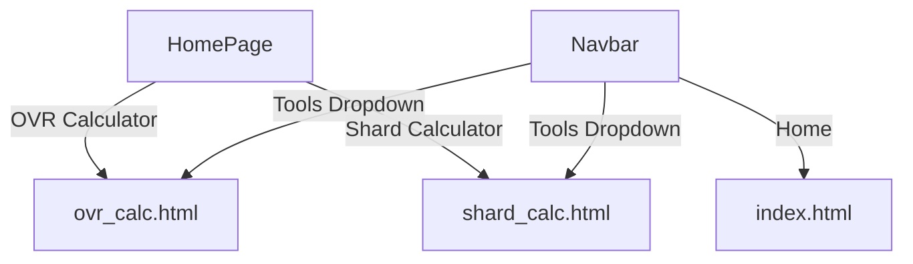

# FC MOBILE Tools Documentation

Welcome to the documentation for the **FC MOBILE Tools** web project, available at [https://fc-tools-two.vercel.app](https://fc-tools-two.vercel.app). This documentation covers all features and logic present in the main files:

- `index.html`
- `ovr_calc.html`
- `shard_calc.html`

These tools help **FC Mobile** players optimize and analyze their teams and resources. Below you'll find detailed explanations, code insights, and design breakdowns for each file.

---

## Homepage: `index.html`

The homepage introduces FC Mobile and provides an interactive entry point to featured tools and app download links.

### Purpose
- Acts as the landing page for all FC Mobile web tools.
- Offers a visually appealing introduction to FC Mobile.
- Provides navigation to OVR and Shard Calculators.
- Features fun, draggable player cards.
- Highlights global game statistics.
- Links to app downloads.

### Key Features

- **Navigation Bar:** Persistent, fixed top, with links to Home, Tools, and Events.
- **Hero Content:** Big title, subtitle, and a drag-and-drop card interface featuring top FC Mobile players.
- **Tools Dropdown:** Quick access to calculators.
- **Download Buttons:** Direct players to Google Play and Apple Store.
- **Global Stats:** Showcases the game's popularity and reach.

### Drag & Drop Card Interaction

Users can drag player cards (Ronaldo, Cruyff, Messi) to rearrange them. This is implemented for both desktop (Drag & Drop API) and mobile (Touch events).

#### Drag & Drop Logic

```js
const cards = document.querySelectorAll('.fc-cards');
let draggedCard = null;

cards.forEach(card => {
  // Desktop
  card.addEventListener('dragstart', handleDragStart);
  card.addEventListener('dragover', handleDragOver);
  card.addEventListener('dragenter', handleDragEnter);
  card.addEventListener('dragleave', handleDragLeave);
  card.addEventListener('drop', handleDrop);
  card.addEventListener('dragend', handleDragEnd);
  // Mobile
  card.addEventListener('touchstart', handleTouchStart);
  card.addEventListener('touchmove', handleTouchMove);
  card.addEventListener('touchend', handleTouchEnd);
});
```

- **Desktop:** Uses standard drag events.
- **Mobile:** Uses touch events and a clone for visual feedback during dragging.

#### Swapping Cards

```js
function swapCards(card1, card2) {
  const allCards = Array.from(document.querySelectorAll('.fc-cards'));
  const index1 = allCards.indexOf(card1);
  const index2 = allCards.indexOf(card2);
  const parent = card1.parentNode;
  const nextSibling1 = card1.nextSibling;
  const nextSibling2 = card2.nextSibling;
  if (index1 < index2) {
    parent.insertBefore(card1, nextSibling2);
    parent.insertBefore(card2, nextSibling1);
  } else {
    parent.insertBefore(card2, nextSibling1);
    parent.insertBefore(card1, nextSibling2);
  }
}
```

---

### Statistics Section

Displays global FC Mobile impact:

| Statistic              | Value      | Description                      |
|------------------------|------------|----------------------------------|
| Total Downloads        | 500M+      | Across iOS and Android           |
| Monthly Active Users   | 8M+        | Active players monthly           |
| Daily Active Users     | 200K+      | Active players daily             |

---

### Navigation Flow

```mermaid
flowchart TD
    Navbar -- Home --> Homepage
    Navbar -- Tools Dropdown --> OVR Calculator
    Navbar -- Tools Dropdown --> Shard Calculator
    Navbar -- Events --> EventsPage
    Homepage -- Drag/Drop --> CardOrder
    Homepage -- Download Btn --> AppStores
```

---

## Team OVR Calculator: `ovr_calc.html`

This page calculates your team's OVR (Overall Rating) based on player stats and rankups.

### Purpose

- Compute team OVR from base player ratings and rankup OVR.
- Show how much more OVR or rankup is needed for the next team OVR increment.
- Help players optimize their squad composition.

### User Input

- **Number of Players:** (11-18)
- **Total Base OVR:** (Sum of all player base OVRs or comma-separated list)
- **Total Rankup OVR:** (Sum of all rankup OVRs)

### Calculation Logic

```js
function calculateOVR() {
  // Get input values
  let baseOvr = parseInt(playerRatingsInput.value);
  let rankupOvr = parseInt(targetOvrInput.value) || 0;
  let numPlayers = parseInt(numPlayersInput.value) || 11;

  // Support for comma-separated base OVRs
  if (playerRatingsInput.value.includes(',')) {
    const ratings = playerRatingsInput.value.split(',').map(Number).filter(n => !isNaN(n));
    baseOvr = ratings.reduce((sum, rating) => sum + rating, 0);
  }

  // OVR Calculation: (base / numPlayers) rounded up + (rankup / numPlayers) rounded up
  const baseOvrCalculated = Math.ceil(baseOvr / numPlayers);
  const rankupOvrCalculated = Math.ceil(rankupOvr / numPlayers);
  const totalOvr = baseOvrCalculated + rankupOvrCalculated;

  // Minimum OVR needed for next increment
  const baseNeededFor1More = (baseOvrCalculated * numPlayers - baseOvr) + 1;
  const rankupNeededFor1More = (rankupOvrCalculated * numPlayers - rankupOvr) + 1;
}
```

### Result Display

- **Total OVR:** Main result
- **Base & Rankup Breakdown:** Shows split
- **How much more OVR needed:** For +1 OVR (both base and rankup)

#### Example Output

| Metric                   | Value           |
|--------------------------|-----------------|
| Team OVR                 | 112             |
| Base OVR (rounded up)    | 109             |
| Rankup OVR (rounded up)  | 3               |
| For +1 Base OVR          | +5 more needed  |
| For +1 Rankup OVR        | +8 more needed  |

---

### Input Prevention

- Only allows numeric input, with min/max enforcement.
- Prevents invalid pasting and typing.

---

### Flow Overview

```mermaid
flowchart TD
    User -- Inputs --> Form
    Form -- onInput/onClick --> calculateOVR()
    calculateOVR() -- computes --> ResultDisplay
    ResultDisplay -- shown --> User
```

---

## Shard Calculator: `shard_calc.html`

This calculator helps players determine how many **shards** they can get by exchanging players of different OVRs.

### Purpose

- Quickly compute total shards from multiple player exchanges.
- Clearly show shard breakdown by player OVR.

### User Input

| Input Field            | Meaning                                         |
|------------------------|-------------------------------------------------|
| 106-108 (10 shards)    | Number of 106-108 OVR players for exchange      |
| 109 (30 shards)        | Number of 109 OVR players for exchange          |
| 110 (60 shards)        | Number of 110 OVR players for exchange          |
| 111 (120 shards)       | Number of 111 OVR players for exchange          |
| 112 (180 shards)       | Number of 112 OVR players for exchange          |
| 113 (250 shards)       | Number of 113 OVR players for exchange          |

### Calculation Logic

```js
function calculateShards() {
  const num106_108 = parseFloat(inputs[0].value) || 0;
  const num109 = parseFloat(inputs[1].value) || 0;
  const num110 = parseFloat(inputs[2].value) || 0;
  const num111 = parseFloat(inputs[3].value) || 0;
  const num112 = parseFloat(inputs[4].value) || 0;
  const num113 = parseFloat(inputs[5].value) || 0;
  const totalShards = num106_108 * 10 + num109 * 30 + num110 * 60 + num111 * 120 + num112 * 180 + num113 * 250;
}
```

- The calculator multiplies the number of each OVR player by the corresponding shard value.
- Outputs both the **total shards** and a breakdown per player OVR.

#### Example Output

| Player OVR   | Count | Shards per | Subtotal |
|--------------|-------|------------|----------|
| 106-108      | 3     | 10         | 30       |
| 109          | 2     | 30         | 60       |
| 110          | 1     | 60         | 60       |
| **Total**    | 6     |            | **150**  |

### Display

- Graphical breakdown per OVR.
- Total number of players and shards.

---

### Flow Overview

```mermaid
flowchart TD
    User -- Inputs --> ShardForm
    ShardForm -- onClick --> calculateShards()
    calculateShards() -- computes --> ShardResultDisplay
    ShardResultDisplay -- shown --> User
```

---

## Consistent UI/UX

All three files share:

- A fixed, modern navbar.
- Responsive, gradient backgrounds.
- Mobile-friendly layouts.
- Stylish, interactive elements.

---

## Navigation & Diagram



---

## Deployment

- The tools are available at: [https://fc-tools-two.vercel.app](https://fc-tools-two.vercel.app)
- No backend/API endpoints; all logic runs client-side.

---

```card
{
  "title": "Key Takeaway",
  "content": "FC MOBILE Tools offers fast, interactive calculators for team OVR and shard exchanges – all in your browser!"
}
```

---

**Enjoy optimizing your FC Mobile experience!**
